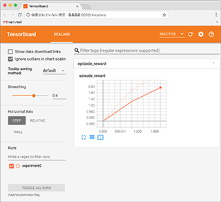

# oculomotor
WBAI 2018 Hackathon Oculomotor Project Repository.

[](https://youtu.be/WH7AUJzk70o)

## Requirements
### Docker
[How to install](https://docs.docker.com/install/)

After successfull install, you should be able to run `docker ps` and get something like this:

```
$ docker ps
CONTAINER ID        IMAGE               COMMAND             CREATED             STATUS              PORTS               NAMES
```

## Usage
The code can be executed in two modes: the interactive mode and batch mode.

### Common Instructions
#### Clone this repository
```
$ git clone --recursive https://github.com/wbap/oculomotor
```

#### Build the docker containers
```
$ cd oculomotor
$ docker build -t wbap/oculomotor .
```

#### Edit the files under `application/functions` as you like

### Running in Interactive Mode
#### Run the container using the helper script
```
$ ./helpers/run_interactive.sh
```

#### Open the monitor interface in the browser
Access the monitor. [http://0.0.0.0:5000/monitor/index.html](http://0.0.0.0:5000/monitor/index.html)


### Running in Batch Mode

#### Run the container using the helper script
```
 $ ./helpers/train.sh --content=1 --step_size=100000
```

### Show training graph

#### Show training graph with TensorBoard tool.
```
 $ ./helpers/board.sh
```
Access the log page. [http://0.0.0.0:6006/](http://0.0.0.0:6006/)

